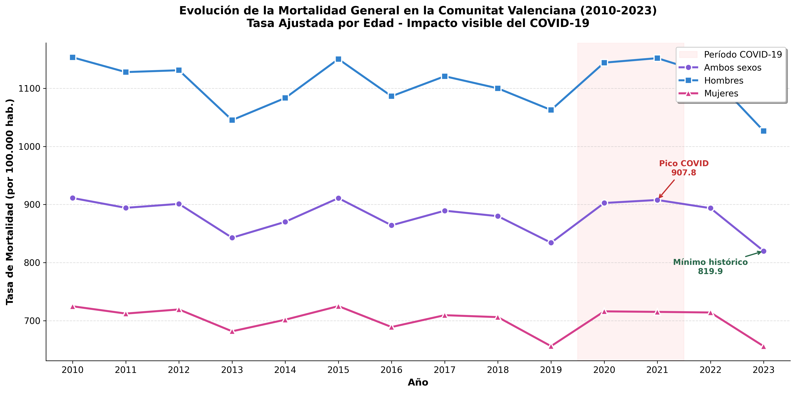
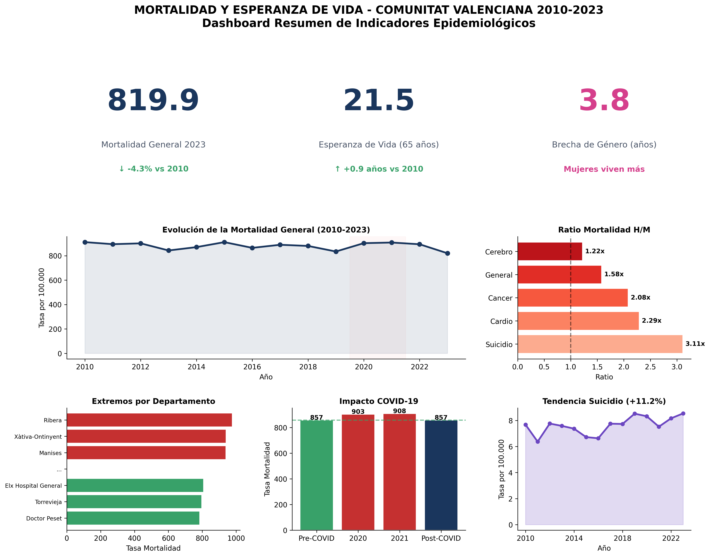

# Mortalidad y Esperanza de Vida en la Comunitat Valenciana (2010-2023)

## Proyecto de Visualización de Datos

**Autor:** Cristóbal Eduardo Aguilar Gallardo  
**Fecha:** Enero 2025  
**Asignatura:** Visualización de Datos - Práctica 2

---

##  Descripción

Este proyecto analiza los indicadores de **mortalidad** y **esperanza de vida a los 65 años** en la Comunitat Valenciana durante el período 2010-2023. El análisis se centra en responder 6 preguntas de investigación clave mediante visualizaciones interactivas.

### Dataset

- **Fuente:** [Portal Estadístico de la Generalitat Valenciana](https://pegv.gva.es/)
- **Registros:** 5.880
- **Variables:** 12
- **Período:** 2010-2023 (14 años)
- **Cobertura:** 24 departamentos de salud, 3 provincias
- **Licencia:** CC-BY / Dominio público

---

##  Preguntas de Investigación

1. ¿Cómo ha evolucionado la mortalidad general y cuál fue el impacto del COVID-19?
2. ¿Cuál es la jerarquía de las principales causas de mortalidad?
3. ¿Existen diferencias significativas en mortalidad y esperanza de vida entre hombres y mujeres?
4. ¿Qué disparidades territoriales existen entre los departamentos de salud?
5. ¿Cuál es la tendencia específica de la mortalidad por suicidio?
6. ¿Existe correlación entre las tasas de mortalidad y la esperanza de vida?

---

##  Hallazgos Principales

| Indicador | Valor | Interpretación |
|-----------|-------|----------------|
| Mortalidad 2023 | 819.9 por 100.000 | Mínimo histórico (-4.3% vs 2010) |
| Esperanza de vida | 21.5 años (a los 65) | +0.9 años vs 2010 |
| Brecha de género | 3.8 años | Mujeres viven más |
| Impacto COVID-19 | +5.6% | Exceso mortalidad 2020-2021 |
| Tendencia suicidio | +11.2% | Única causa en aumento |
| Disparidad territorial | 1.25x | Ratio máx/mín entre departamentos |

---

##  Estructura del Repositorio

```
├── README.md                    # Este archivo
├── data/
│   └── mortalidad_esperanza_vida_cv.csv  # Dataset principal
├── codigo/
│   └── generar_figuras.py      # Script Python con todo el código
├── figuras/
│   ├── fig1_evolucion_mortalidad_general.png
│   ├── fig2_jerarquia_causas_mortalidad.png
│   ├── fig3_evolucion_causas_especificas.png
│   ├── fig4_disparidad_genero_ratio.png
│   ├── fig5_comparativa_sexo_causa.png
│   ├── fig6_esperanza_vida_genero.png
│   ├── fig7_ranking_departamentos.png
│   ├── fig8_heatmap_departamentos.png
│   ├── fig9_tendencia_suicidio.png
│   ├── fig10_scatter_correlacion.png
│   ├── fig11_comparativa_provincias.png
│   ├── fig12_impacto_covid.png
│   └── fig13_dashboard_resumen.png
├── docs/
│   ├── GUION_VIDEO.md          # Guion del vídeo de presentación
│   └── JUSTIFICACION_VISUAL.md # Justificación de codificaciones
└── dashboard/
    └── index.html              # Dashboard interactivo
```

---

## ️ Requisitos

```bash
pip install pandas matplotlib seaborn numpy scipy
```

---

##  Uso

### Generar todas las figuras:

```bash
cd codigo
python generar_figuras.py
```

### Ver el dashboard interactivo:

Abrir `dashboard/index.html` en un navegador o acceder al enlace publicado.

---

##  Visualizaciones

### Figura 1: Evolución Temporal


### Figura 13: Dashboard Resumen


---

##  Codificaciones Visuales

| Elemento | Codificación | Justificación |
|----------|--------------|---------------|
| Series temporales | Gráfico de líneas | Expresividad para datos continuos |
| Comparación por sexo | Barras + colores azul/rosa | Convención y efectividad |
| Disparidades territoriales | Heatmap + barras | Patrones bidimensionales |
| Correlaciones | Scatter plot | Estándar para relaciones bivariadas |
| Período COVID | Sombreado rojo | Destaque visual del período crítico |

---

##  Vídeo de Presentación

[Enlace al vídeo] - Duración: 6-8 minutos

---

##  Dashboard Interactivo

https://practica-de-visualizacion-2026.vercel.app/

---

##  Referencias

- Portal Estadístico GVA: https://pegv.gva.es/
- Conselleria de Sanitat: https://www.san.gva.es/

---

##  Licencia

Este proyecto está bajo licencia MIT. Los datos originales son de dominio público (CC-BY).

---

##  Contacto

**Cristóbal Eduardo Aguilar Gallardo**  
Hospital Universitari i Politècnic La Fe  
Valencia, España
